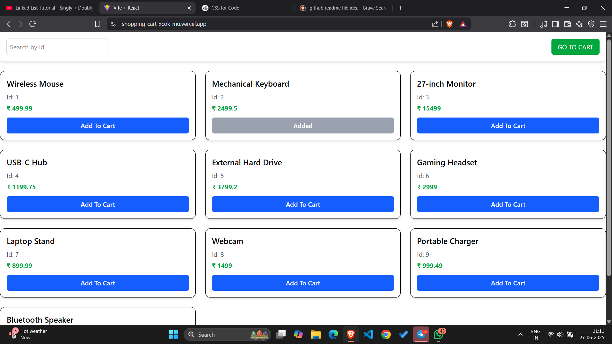
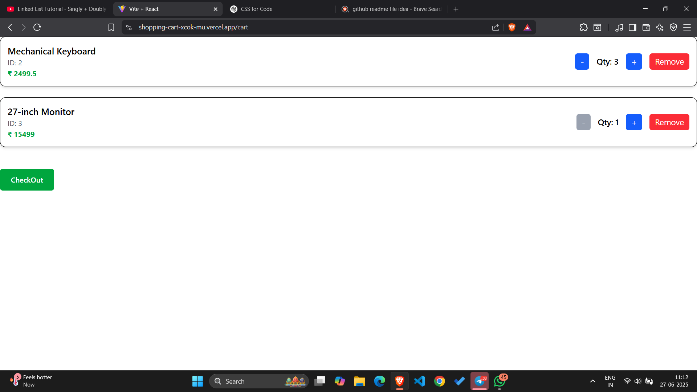
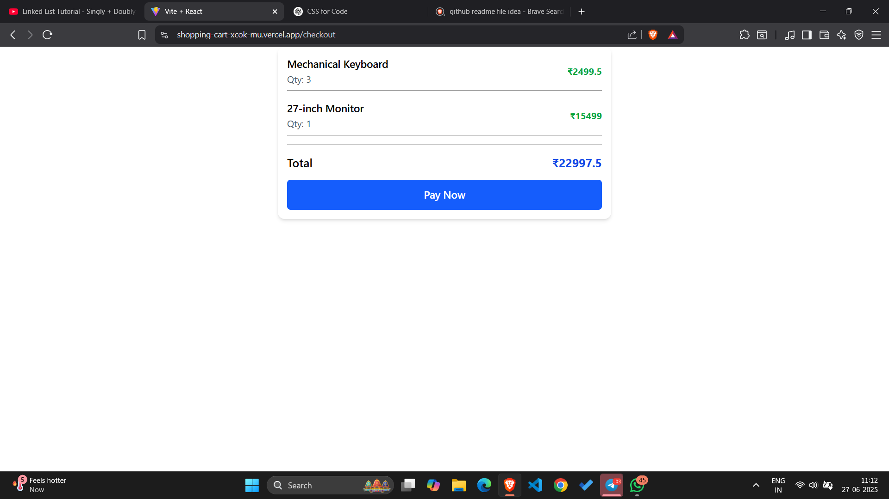

7# 🛒 React Shopping App

A simple and responsive Single Page Application (SPA) built using **React**, **Vite v6**, **Tailwind CSS**, and **React Router DOM**. The app demonstrates modern frontend best practices, including routing, reusable components, and responsive UI.


🔗 **Live Demo**: [shopping-cart-xcok-mu.vercel.app](https://shopping-cart-xcok-mu.vercel.app)
---

## 🚀 Features

- 🔍 Product search by ID
- 🛍️ Add to cart functionality
- 🧮 Quantity controls
- 💵 Total price calculation
- 🧾 Checkout + Thank you page
- 🌐 Single Page Routing with `react-router-dom`
- 💨 Fully responsive using Tailwind CSS
- ⚡ Fast builds with Vite v6

---

## 🧩 Tech Stack

- **React** (functional components with hooks)
- **Vite** (version 6)
- **Tailwind CSS** (via @tailwindcss/vite)
- **React Router DOM** (for SPA navigation)

---

## 📁 Project Structure
```
📦 src/
 ┣ 📂components/        
 ┃ ┣ 📜AppLayout.jsx     ─ Wrapper layout for consistent page structure
 ┃ ┣ 📜Cart.jsx          ─ Displays items added to cart
 ┃ ┣ 📜Catalog.jsx       ─ Shows product listings
 ┃ ┣ 📜Checkout.jsk      ─ checkout
 ┃ ┗ 📜Feedback.jsx      ─ display message to thanks customer
 ┣ 📜App.jsx             ─ Main entry component, includes all sections or router config
 ┣ 📜main.jsx            ─ React root setup and Vite app mount point
 ┣ 📜index.css           ─ Tailwind CSS imports and global styles
┗ 📜...other files       ─ Additional utilities, data files, or config (e.g., assets, hooks)

```

---

## 🛠️ Installation

1. **Clone the repository:**

```bash
git clone https://github.com/Jaypatwal102/Shopping-cart.git
cd Shopping-cart

2. Install dependencies:
npm install

3. Start the development server:
npm run dev

🔗 Pages
/ — AppLayout - Search + Product list

/cart — Cart page with quantity controls

/checkout — Checkout view

/feedback — Final thank you message

```
## 🖼️ Screenshots

### 🏠 Home Page


### 🛒 Cart Page


### 💳 Checkout Page


👨‍💻 Author
Jay Patwal
MCA @ NIT Agartala
Passionate about building real-world React and backend applications.


